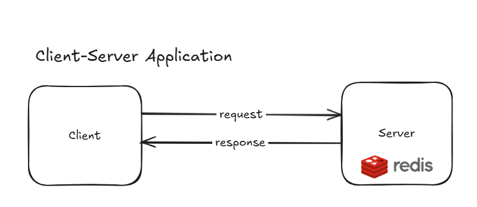
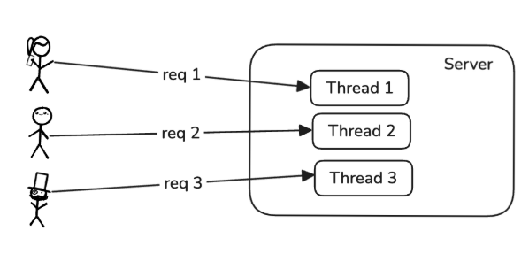
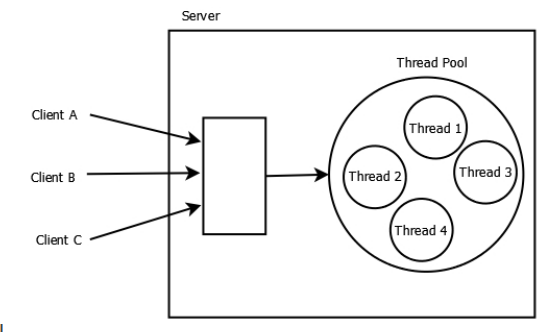
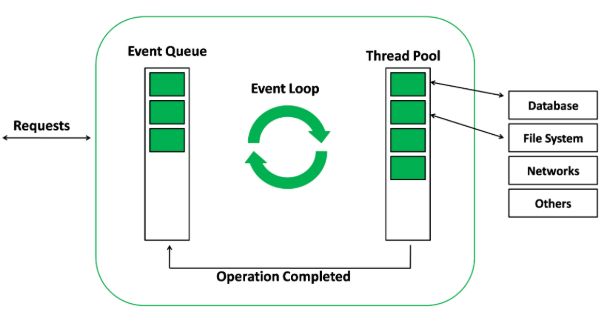
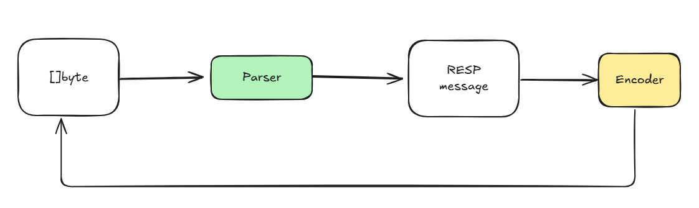
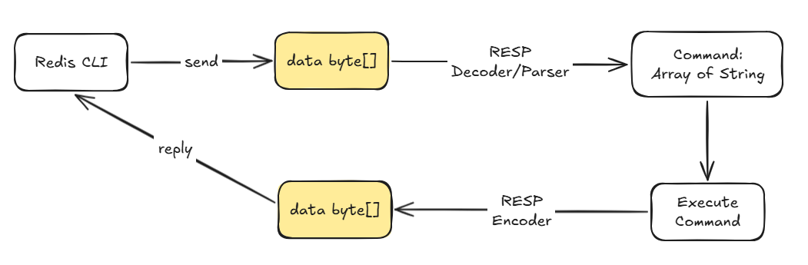

# redis-clone

## Overview
A Redis inspired key-value store supporting multi-thread capability

### Why re-inventing the wheel?
Review my own knowledge on the concepts of:
- Redis concept (RESP, storage data structures, methods,...)
- Basic knowledge on OS (virtualization, concurrency and persistence)
- TCP server from scratch
- I/O models and concurrency related systemcalls (epoll, kqueue...)

#### TODO
- [x] Multi-threaded TCP server using goroutine
    - [x] I/O multiplexing model with threadpool
- [x] RESP protocol parser
    - [x] Simple string, bulk string parser
    - [x] Integer parser
    - [x] Error parser
    - [x] Array parser
    - [x] Parser tests
- [ ] Redis commands implementation:
    - [ ] PING
    - [ ] GET
    - [ ] SET
- [ ] Sorted-set implementation

## REDIS
A in-memory key-value store, stores data in RAM, use AOF (append-only file) command log for persistence

**Key Characteristics:**
- Use RESP protocol (built on top of TCP, simple to parse)
- Redis uses 1 thread **to process user's requests** but do have background thread for other tasks such as logging
- Redis **write to memory first** then append to the AOF log. Trades persistence for speed, data can restore from AOF command log but there can be data loss

## Detail design and implementation:

### TCP server from scratch

<details>
<summary><strong>Request Response Model</strong></summary>

<br>

<p align="left">

</p>
The basic client-server architecture where clients send requests and the server processes them synchronously.

<br>

</details>

#### Multi-threading Connection Models:

<details>
<summary><strong>Thread per Connection Model</strong></summary>

<br>

<p align="left">

</p>

| ✅ **Pros** | ❌ **Cons** |
|-------------|-------------|
| Simple to implement | High memory and CPU overhead |
| Leverages multi-core processor | Risk of race condition |
| Handle blocking I/O | Thread creation overhead |

<br>

</details>

<details>
<summary><strong>Thread Pool Model</strong></summary>

<br>

<p align="left">

</p>

| ✅ **Pros** | ❌ **Cons** |
|-------------|-------------|
| Avoid hardware overload | Hard to configure pool size |
| Better resource management | High overhead for short tasks |
| Reuse threads efficiently | More complex implementation |

<br>

</details>

<details>
<summary><strong>Event Driven Model</strong></summary>

<br>

<p align="left">

</p>

| ✅ **Pros** | ❌ **Cons** |
|-------------|-------------|
| Scalable for I/O bound apps | Complex implementation |
| Efficient resource usage | CPU-bound operations block everything |
| Reduced race conditions | Callback complexity |

<br>

</details>

#### **Our Choice:** For simplicity's sake, we implement **thread pool with graceful shutdown** TCP server
- [web-server](internal/server/server.go)
- [threadpool](threadpool/pool.go)

### RESP Protocol

Serialization protocol of redis, protocol is text based separated by CRLF. [See more details](https://redis.io/docs/latest/develop/reference/protocol-spec/)

**Currently Supported Protocols:**

| Type | Indicator | Format | Example |
|------|-----------|--------|---------|
| **Simple String** | `+` | `+<string>\r\n` | `+OK\r\n` |
| **Bulk String** | `$` | `$<length>\r\n<body>\r\n` | `$5\r\nhello\r\n` |
| **Integer** | `:` | `:[<+\|->]<value>\r\n` | `:42\r\n` |
| **Error** | `-` | `-<message>\r\n` | `-Error message\r\n` |
| **Array** | `*` | `*<count>\r\n<element-1>...<element-n>` | `*2\r\n$3\r\nfoo\r\n:42\r\n` |

**Features:**
- [Simple string](https://redis.io/docs/latest/develop/reference/protocol-spec/#simple-strings) and [Bulk String](https://redis.io/docs/latest/develop/reference/protocol-spec/#bulk-strings): Body cannot contain CRLF
- [Integer](https://redis.io/docs/latest/develop/reference/protocol-spec/#integers): Encoded with sign and value
- [Error](https://redis.io/docs/latest/develop/reference/protocol-spec/#simple-errors): Specifically for error responses
- [Array](https://redis.io/docs/latest/develop/reference/protocol-spec/#arrays): Support both nested array and mixed type array with `[]interface{}`

**Testing:** Protocol parser tests are in [test module](./internal/protocol/test)

### Redis Commands

Based on [redis official documentation](https://redis.io/docs/latest/commands/), there are many commands available. This repository currently supports simple **PING**, **GET**, **SET** commands.

**RESP Recall Flow:**

<div align="center">

</div>

**Command Logic Flow:**

<div align="center">

</div>

### Operating System Concepts

<details>
<summary><strong>Basic OS Knowledge Overview</strong> - <a href="https://pages.cs.wisc.edu/~remzi/OSTEP/">Based on OSTEP</a></summary>

**Operating System Nature:**
- **Is a process itself**, sleeps in the background and constantly wakes up via interrupt to do tasks

**Virtualization of Resources:**
- Helps multiple programs **share** physical resources like RAM, CPU,...

**Process Abstraction:**
- Each process is an abstraction of a program
- Each process is a set of memory addresses wrapped into a sandbox for isolation

**Memory Abstraction (Address Space):**
- **Virtual view** of the memory address, isolated for each process
- Mapped to physical address by OS itself
- Byte level mapping via page/framing

**I/O Resource Management:**
- A data structure that manages **virtual view** of resources like files, sockets, pipes, I/O streams...
- A process can create another process (**threading**) by invoking system call

</details>

<details>
<summary><strong>Concurrency Management</strong></summary>

**Context Switching:**
- Provides concurrency via **context switching** (tells CPU thread what to run next)
- Two main models: **proportional share** and **Multi-level Feedback Queue** (MLFQ)

**Linux Implementation:**
- Uses **proportional share model** - processes each have a proportion of execution time
- Implemented using **red-black tree**:
  - Each *node* is a task/process
  - Left most node is chosen to run (smallest `vruntime`)
  - `vruntime` changes based on delta time on context switch and `nice` values

**Synchronization:**
- Provides **semaphore** for synchronization
- Semaphore is a kernel resource with atomic operations

</details>

<details>
<summary><strong>Persistence Layer</strong></summary>

**Address Mapping:**
- Handles mapping between *virtual address/view* of processes to *physical address* of resources on disk, RAM,...

**Data Protection:**
- Provides data integrity and protection to files and disk storage
- File system guarantees and consistency mechanisms

</details>

---

## 🚀 Getting Started

```bash
# Clone and run
git clone git@github.com:viet2307/redis-clone.git
cd redis-clone
go run cmd/tcp-server/main.go

# Test with redis-cli
redis-cli -p 6379
```

## 📚 References
- [Redis Protocol Specification](https://redis.io/docs/latest/develop/reference/protocol-spec/)
- [Redis Commands Documentation](https://redis.io/docs/latest/commands/)
- [Operating Systems: Three Easy Pieces](https://pages.cs.wisc.edu/~remzi/OSTEP/)